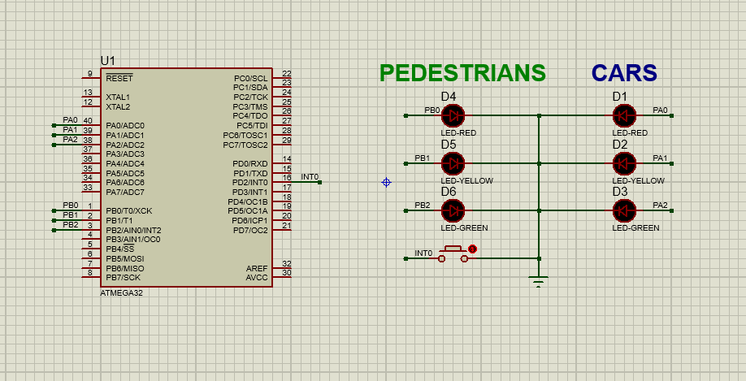

<h1 align="center"> Traffic system </h1>

 Udacity Embedded systems nanodegree graduation project   

<h2> Hardware requirements </h2>

- ATmega32 microcontroller.
- One push button connected to INT0 pin for pedestrian.
- Three LEDs for cars - Green, Yellow, and Red, connected on port A, pins 0, 1, and 2.
- Three LEDs for pedestrians - Green, Yellow, and Red, connected on port B, pins 0, 1, and 2.

<h2> Software requirements </h2>

<h3> Normal mode </h3>

- Cars' LEDs will be changed every five seconds starting from Green then yellow then red then yellow then Green.
- The Yellow LED will blink for five seconds before moving to Green or Red LEDs.

<h3> Pedestrian  mode </h3>

- Change from normal mode to pedestrian mode when the pedestrian button is pressed.
- If pressed when the cars' Red LED is on, the pedestrian's Green LED and the cars' Red LEDs will be on for five seconds, this means that pedestrians can cross the street while the pedestrian's Green LED is on.
- If pressed when the cars' Green LED is on or the cars' Yellow LED is blinking, the pedestrian Red LED will be on then both Yellow LEDs start to blink for five seconds, then the cars' Red LED and pedestrian Green LEDs are on for five seconds, this means that pedestrian must wait until the Green LED is on.
- At the end of the two states, the cars' Red LED will be off and both Yellow LEDs start blinking for 5 seconds and the pedestrian's Green LED is still on.
- After the five seconds the pedestrian Green LED will be off and both the pedestrian Red LED and the cars' Green LED will be on.
- Traffic lights signals are going to the normal mode again.

<h2> System design </h2>

 
